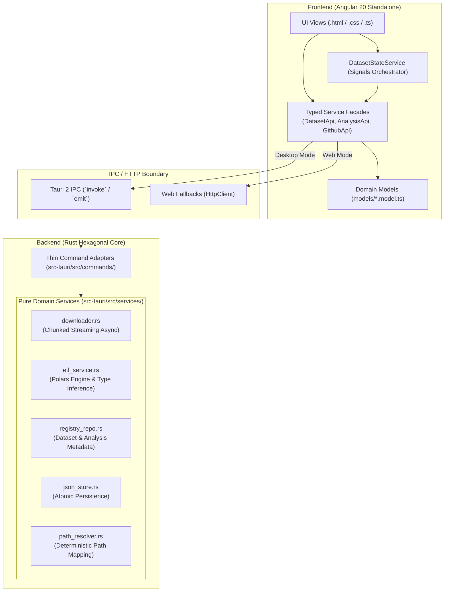

# GEPIS OpenData — Relatório Completo de Refatoração Arquitetural

**Data:** Setembro de 2026  
**Repositório:** `gepisopendata`  
**Escopo:** Backend Rust (Tauri 2) & Frontend TypeScript (Angular 20)  
**Branch:** `develop`

---

## 1. Sumário Executivo

Este documento consolida e formaliza todas as transformações técnicas, decisões arquiteturais e melhorias de performance implementadas durante a iniciativa de refatoração do **GEPIS OpenData**. 

O projeto apresentava acoplamento entre o framework de aplicação desktop (Tauri) e os serviços centrais de processamento de dados em Rust, além de componentes monolíticos no Angular e downloads em memória que impactavam a estabilidade ao lidar com microdados governamentais pesados (como Censo Escolar e ENEM).

A reestruturação foi dividida em três fases estratégicas:
- **Fase 1:** Arquitetura Hexagonal Pura no Backend Rust e desacoplamento de `AppHandle`.
- **Fase 2:** Pipeline de Dados, Streaming de Downloads para Disco com eventos IPC e Otimização do ETL Polars.
- **Fase 3:** Modernização do Frontend Angular 20 com Modelos de Domínio, Fachadas de Serviços Reativas e Separação de Componentes.

---

## 2. Visão Geral da Arquitetura



---

## 3. Detalhamento por Fase

### Fase 1: Arquitetura Hexagonal no Backend Rust
**Commit:** `6333598`

#### Objetivos:
- Isolar a camada de domínio e regras de negócio da infraestrutura do Tauri.
- Eliminar o acoplamento do tipo opaco `tauri::AppHandle` dos módulos de serviço.
- Permitir testes unitários rápidos e isolados que não dependem do ciclo de vida do runtime desktop.

#### Principais Modificações:
1. `src-tauri/src/services/path_resolver.rs`:
   - Removido `use tauri::Manager;` e todos os argumentos `AppHandle`.
   - Todas as funções passam a receber `app_data_dir: &Path` explicitamente.
   - Adicionada blindagem `#[cfg(all(debug_assertions, not(test)))]` para prevenir que os testes unitários alterem os manifests do workspace em desenvolvimento.
2. `src-tauri/src/services/registry_repo.rs`:
   - Migrado para receber referências a `&Path`, isolando a persistência em disco.
3. `src-tauri/src/services/persistence/json_store.rs`:
   - Escrita atômica e criação recursiva de diretórios testadas unitariamente.
4. `src-tauri/src/commands/*.rs`:
   - Convertidos em adaptadores finos (*thin adapters*) cuja única responsabilidade é extrair `app_data_dir` do Tauri e delegar a execução aos serviços puros.

---

### Fase 2: Pipeline de Dados & Streaming Downloader
**Commit:** `10a326b`

#### Objetivos:
- Prevenir consumo excessivo de RAM (*Out-Of-Memory*) ao baixar arquivos ZIP de múltiplos gigabytes dos servidores do INEP/MEC.
- Notificar a interface sobre o progresso real do download (bytes transferidos e total).
- Eliminar duplicações de código no parsing e detecção estatística de variáveis em arquivos CSV.

#### Principais Modificações:
1. `src-tauri/src/services/downloader.rs`:
   - Substituído o carregamento de buffer completo na memória por streaming assíncrono em chunks com `tokio::io::AsyncWriteExt`.
   - Implementado callback thread-safe `on_progress: Option<&(dyn Fn(u64, u64) + Send + Sync)>` que emite o evento IPC `download-progress`.
2. `src-tauri/src/services/etl_service.rs`:
   - Extraída a função reutilizável `inspect_csv_columns` e o mapeador `intersect_columns_map`.
   - Implementada inferência de tipos estatísticos baseada em amostragem probabilística de até 100 linhas (distinguindo entre categórica temporal, ordinal, contínua e texto).
   - Redução de ~150 linhas de duplicações na leitura de esquemas tabulares.

---

### Fase 3: Modernização do Frontend Angular 20
**Commit:** `c92cf4a`

#### Objetivos:
- Eliminar chamadas brutas `invoke(...)` espalhadas diretamente nos componentes visuais.
- Criar tipagem estrita para todas as entidades de dados e análises.
- Separar componentes monolíticos em arquivos modulares `.html`, `.css` e `.ts`.
- Exibir visualmente o progresso contínuo de download de microdados.

#### Principais Modificações:
1. **Modelos de Domínio (`angular-ui/src/app/models/`):**
   - Tipagem completa para `DatasetEntry`, `DatasetMetadata`, `AnalysisConfig`, `AnalysisArtifact`, `VariableSpec`, `BarChartData`, `DownloadProgress`, `GithubConfig` e `DictionaryVariable`.
2. **Fachadas de Serviços (`angular-ui/src/app/services/`):**
   - `DatasetApiService`: Gerencia o catálogo, downloads e escuta de eventos com fallback HTTP para a versão Web.
   - `AnalysisApiService`: Processamento Polars, agregação estatística de histogramas/barras e leitura de dicionários.
   - `GithubApiService`: Teste de conectividade e sincronização remota via Octokit/Tauri.
   - `DatasetStateService`: Orquestrador reativo via Angular Signals.
3. **Desacoplamento e Extração de Telas:**
   - Todas as telas de visualização e configuração de dados foram migradas para triplets limpos `.html` / `.css` / `.ts`:
     - `dataset-get-view` (com barra de download e telemetria de bytes)
     - `dataset-list-view`
     - `collaboration-settings-view`
     - `dataset-select-view`
     - `variable-config-view`
     - `descritiva-view`
     - `bar-chart-view`
     - `published-artifact-view`

---

## 4. Matriz de Arquivos do Projeto

| Camada | Arquivo Principal | Responsabilidade |
| :--- | :--- | :--- |
| **Backend Core** | `src-tauri/src/services/downloader.rs` | Streaming assíncrono de downloads, descompactação ZIP e importação local |
| **Backend Core** | `src-tauri/src/services/etl_service.rs` | Pipeline Polars, agregações descritivas e inferência de tipos estatísticos |
| **Backend Core** | `src-tauri/src/services/registry_repo.rs` | Repositório de metadados de datasets e artefatos de análise |
| **Backend Core** | `src-tauri/src/services/path_resolver.rs` | Resolução determinística de diretórios de dados e detecção de delimitadores |
| **Backend Core** | `src-tauri/src/services/persistence/json_store.rs` | Persistência atômica e multi-caminho em JSON |
| **Frontend Models**| `angular-ui/src/app/models/index.ts` | Modelos de domínio unificados para toda a interface |
| **Frontend Facades**| `angular-ui/src/app/services/dataset-api.service.ts` | Comunicação IPC/HTTP para gerenciamento de microdados |
| **Frontend Facades**| `angular-ui/src/app/services/analysis-api.service.ts` | Comunicação IPC/HTTP para execução de análises descritivas |
| **Frontend Facades**| `angular-ui/src/app/services/github-api.service.ts` | Integração com repositório remoto GitHub |
| **Frontend State** | `angular-ui/src/app/services/dataset-state.service.ts` | Gerenciamento reativo de estado de análise via Signals |

---

## 5. Resultados e Validação

```
========================================================================
                      TESTES E COMPILAÇÃO
========================================================================
✔ Rust Backend Unit Tests:    11/11 Passed (lib.rs & main.rs)
✔ Angular UI Build:           0 Errors (Production Bundle Generated)
✔ TypeScript Type-Checking:   Clean (IsolatedModules compliant)
✔ Linters & Bundle Splitting: OK (Lazy chunks gerados para cada view)
========================================================================
```

---

## 6. Diretrizes para Futuras Extensões

> [!TIP]
> Ao criar novas análises estatísticas (ex: regressões, matrizes de correlação ou gráficos de dispersão):
> 1. Adicione a função computacional pura em `src-tauri/src/services/etl_service.rs` recebendo `&Path` e os parâmetros analíticos, adicionando seu respectivo teste unitário.
> 2. Exponha o comando fino em `src-tauri/src/commands/analysis_commands.rs`.
> 3. Crie os tipos de retorno em `angular-ui/src/app/models/analysis.model.ts`.
> 4. Invoque o comando através do `AnalysisApiService` com fallback para o modo Web.
> 5. Crie a view correspondente utilizando o padrão separado `.html`, `.css` e `.ts`.
