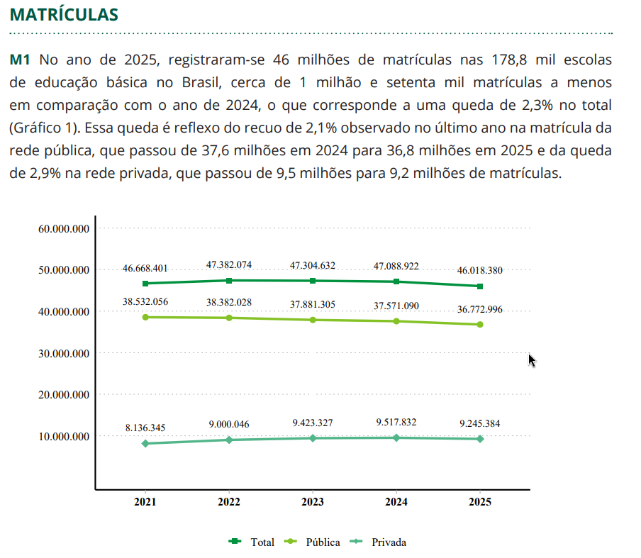
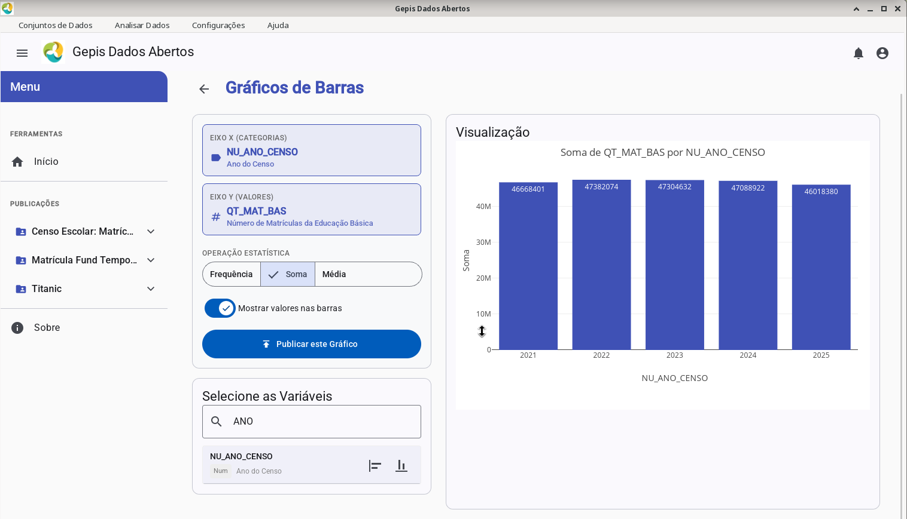

#+Title: Apresentação da Ferramenta Gepis Dados Abertos

* Metodo de conferencia dos dados
Método simples, olhando no documento [[https://download.inep.gov.br/publicacoes/institucionais/estatisticas_e_indicadores/notas_estatisticas_censo_escolar_da_educacao_basica_2025.pdf][oficial publicado]] as informações
e simplesmente verificando se chagamos às mesmas informações
produzindo gráficos na nossa ferramenta.

* Numero de Matrícula p.7

NU_ANO_CENSO: Ano de referência do censo (eixo X: 2021 a 2025).

QT_MAT_BAS: Quantidade de matrículas da Educação Básica (métrica agregada).

TP_DEPENDENCIA: Dependência administrativa da escola (responsável pela separação entre pública e privada).

